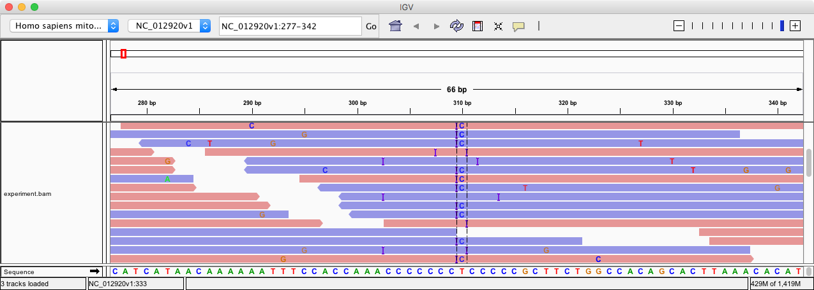

We want to simulate the effects of introducing the mutation

    CCAAACCCCCCC-T-CCCCCGCTTC
    CCAAACCCCCCCCTCCCCCCGCTTC

Create the modification for the `T` base at position 310:

    # Set up the shorcuts
    REF=~/refs/hs/mitoc.fa
    REAL=real.fa

    # Create the desired file
    echo ">foo" > insert.fa
    echo "CTC" >> insert.fa

    # Cut the `T` then insert the new sequence:
    cp $REF $REAL
    cutseq -filter $REF -from 310 -to 310 > temp.fa
    pasteseq -filter temp.fa insert.fa -pos 309 > $REAL

    # We want to simulate from the REAL genome and with no mutations.
    # Set the output distance between pairs to 200. Otherwise only forward
    # reads will cover the site.
    alias generate_experimental_data='dwgsim -d 200 -r 0 -N 5000 $REAL experiment'

    # Generate and create the alignment.
    generate_exprimental_data; align_experimental_data

Here is what happened at position `310`

For almost all reads the reported alignment is an insertion of `CT` followed by a mismatch of
`T` to `C`:

    CCAAACCCCCCC--TCCCCCGCTTC
    CCAAACCCCCCCCTCCCCCCGCTTC

Instead of what we have actually done: we have inserted a `C` on both sides of `T`:

    CCAAACCCCCCC-T-CCCCCGCTTC
    CCAAACCCCCCCCTCCCCCCGCTTC

The reason here is that the cost of one insertion + extension + mismatch is
smaller than that of two insertions.

Let's see what our snp caller says:

    # Samtools
    samtools mpileup -uvf $REF experiment.bam | bcftools call -vm -O v > samtools.vcf

    # Freebayes
    freebayes -p 1 -f $REF --use-mapping-quality experiment.bam > freebayes.vcf

Let's see what they say:

